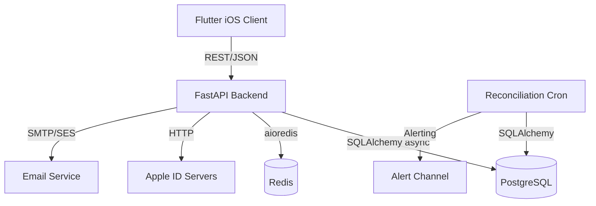
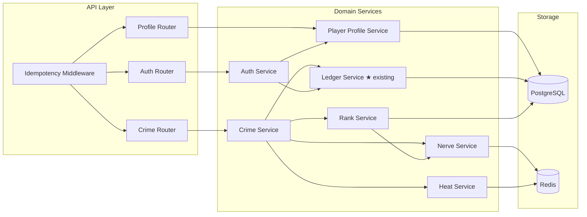
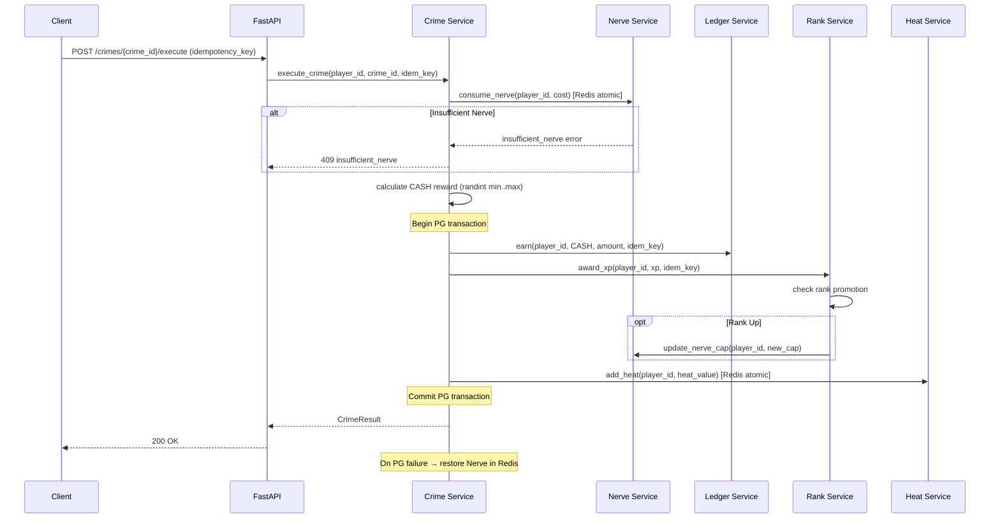
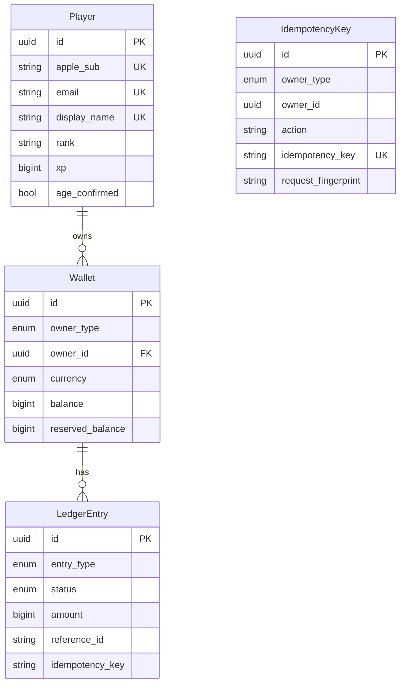

# Design Document — AI MAFIA: Milestone 1 (Core & Economy)

## Overview

Milestone 1 delivers the foundational gameplay loop: authenticate → create profile → spend Nerve → execute crime → earn CASH + XP → rank up. The backend is a FastAPI (Python 3.12 async) service backed by PostgreSQL (relational state, immutable ledger) and Redis (Nerve regeneration, cooldowns, OTP storage, rate limiting). All economy mutations flow through the existing append-only Ledger Service. The client is Flutter (iOS-first) and communicates via REST/JSON.

This design covers six backend service domains (Auth, Player Profile, Nerve, Crime, Heat, Rank), the Ledger/Wallet economy layer (already partially implemented), a daily reconciliation job, idempotency middleware, and a configuration system for runtime-tunable game constants.

### Key Design Decisions

1. **Nerve in Redis, not Postgres** — Nerve regeneration is computed lazily on read (elapsed time since last update). Redis provides sub-millisecond reads and atomic DECRBY for consumption. No background tick process needed.
2. **Crime execution as a single DB transaction** — Nerve deduction (Redis) happens first; if the subsequent Postgres transaction (ledger credit, XP award, Heat increase) fails, Nerve is restored via a compensating Redis write. This avoids distributed transactions.
3. **EARN entry type for crime rewards** — The existing Ledger Service supports RESERVE/CAPTURE/RELEASE. Crime payouts use the simpler EARN path: a single POSTED ledger row that directly increases wallet balance.
4. **Lazy Nerve regeneration** — Instead of a background worker ticking every 180s per player, Nerve is calculated on-demand: `current = min(stored + floor((now - last_update) / regen_interval), cap)`. Redis stores `(nerve_value, last_update_ts)`.
5. **Heat decay via lazy computation** — Same pattern as Nerve: `current_heat = max(stored_heat - floor((now - last_update) / decay_interval), 0)`. No background worker.
6. **Configuration via environment variables + Redis overrides** — Base config from env vars (12-factor), with optional Redis key overrides for hot-reload without restart.

## Architecture

### System Context Diagram



### Service Architecture



### Crime Execution Flow



## Components and Interfaces

### 1. Auth Service (`services/api_fastapi/domain/services/auth_service.py`)

**Responsibilities:** Apple Sign-In verification, Email OTP flow, age gate, JWT issuance.

```python
class AuthService:
    async def apple_sign_in(self, identity_token: str) -> AuthResult:
        """Verify Apple token, create-or-fetch player, return JWT."""

    async def request_otp(self, email: str) -> None:
        """Generate 6-digit OTP, store in Redis with 10min TTL, send email."""

    async def verify_otp(self, email: str, code: str) -> AuthResult:
        """Validate OTP, create-or-fetch player, return JWT."""

    async def confirm_age(self, player_id: UUID, confirmed: bool) -> None:
        """Persist age confirmation. Deny access if not confirmed."""
```

**Dependencies:** Redis (OTP storage, rate limiting), PostgreSQL (player records), Apple HTTP client, Email sender.

### 2. Player Profile Service (`services/api_fastapi/domain/services/profile_service.py`)

**Responsibilities:** Profile CRUD, display name validation, profile read aggregation.

```python
class PlayerProfileService:
    async def create_profile(self, player_id: UUID) -> PlayerProfile:
        """Initialize profile with defaults: Empty-Suit, XP=0, Heat=0, Nerve=50."""

    async def update_display_name(self, player_id: UUID, name: str, idem_key: str) -> PlayerProfile:
        """Validate name (3-20 chars, alphanumeric+underscore, unique), update."""

    async def get_profile(self, player_id: UUID) -> PlayerProfileResponse:
        """Aggregate: profile + wallet balance + nerve (from Redis) + heat (from Redis)."""
```

### 3. Nerve Service (`services/api_fastapi/domain/services/nerve_service.py`)

**Responsibilities:** Nerve read (with lazy regen), atomic consumption, cap updates.

```python
class NerveService:
    async def get_nerve(self, player_id: UUID) -> NerveState:
        """Compute current nerve with lazy regen, return (current, max, next_regen_at)."""

    async def consume_nerve(self, player_id: UUID, amount: int) -> NerveState:
        """Atomically decrement nerve. Raises InsufficientNerve if not enough."""

    async def restore_nerve(self, player_id: UUID, amount: int) -> None:
        """Compensating action: restore nerve after failed downstream transaction."""

    async def update_cap(self, player_id: UUID, new_cap: int) -> None:
        """Update nerve cap on rank promotion."""
```

**Redis key:** `nerve:{player_id}` → Hash `{value: int, last_update: float, cap: int}`

**Lua script for atomic consume:**
```lua
-- KEYS[1] = nerve:{player_id}
-- ARGV[1] = cost, ARGV[2] = now_ts, ARGV[3] = regen_interval, ARGV[4] = cap
local val = tonumber(redis.call('HGET', KEYS[1], 'value'))
local last = tonumber(redis.call('HGET', KEYS[1], 'last_update'))
local cap = tonumber(redis.call('HGET', KEYS[1], 'cap'))
local now = tonumber(ARGV[2])
local interval = tonumber(ARGV[3])
local regen = math.floor((now - last) / interval)
local current = math.min(val + regen, cap)
local cost = tonumber(ARGV[1])
if current < cost then return -1 end
redis.call('HSET', KEYS[1], 'value', current - cost, 'last_update', now)
return current - cost
```

### 4. Crime Service (`services/api_fastapi/domain/services/crime_service.py`)

**Responsibilities:** Orchestrate PvE crime execution pipeline.

```python
class CrimeService:
    async def execute_crime(
        self, player_id: UUID, crime_id: str, idempotency_key: str
    ) -> CrimeResult:
        """
        1. Check idempotency (return cached if replay)
        2. Consume Nerve (Redis)
        3. Calculate CASH reward (randint)
        4. In single PG transaction:
           a. Ledger EARN (credit CASH)
           b. Award XP (check rank promotion)
           c. Add Heat (Redis, outside txn but after commit)
        5. Store idempotency result
        On PG failure: restore Nerve via compensating Redis write.
        """
```

### 5. Heat Service (`services/api_fastapi/domain/services/heat_service.py`)

**Responsibilities:** Heat tracking with lazy decay.

```python
class HeatService:
    async def get_heat(self, player_id: UUID) -> int:
        """Compute current heat with lazy decay."""

    async def add_heat(self, player_id: UUID, amount: int) -> int:
        """Atomically add heat, clamp at 100. Returns new value."""
```

**Redis key:** `heat:{player_id}` → Hash `{value: int, last_update: float}`

### 6. Rank Service (`services/api_fastapi/domain/services/rank_service.py`)

**Responsibilities:** XP accumulation, rank promotion (including multi-rank jumps).

```python
RANK_TABLE = [
    ("Empty-Suit",  0,         50),
    ("Runner",      1_000,     75),
    ("Enforcer",    5_000,     100),
    ("Capo",        25_000,    150),
    ("Fixer",       100_000,   200),
    ("Underboss",   500_000,   250),
    ("Godfather",   2_000_000, 300),
]

class RankService:
    async def award_xp(
        self, session: AsyncSession, player_id: UUID, xp: int, idem_key: str
    ) -> RankResult:
        """Add XP, check for promotion (including multi-rank), update nerve cap if promoted."""

    def compute_rank(self, total_xp: int) -> tuple[str, int]:
        """Pure function: given total XP, return (rank_name, nerve_cap)."""
```

### 7. Reconciliation Job (`services/api_fastapi/domain/jobs/reconciliation.py`)

```python
class ReconciliationJob:
    async def run(self) -> ReconciliationReport:
        """
        For each wallet:
          expected = SUM(amount) of POSTED entries with matching (owner_type, owner_id, currency)
                     considering EARN/CAPTURE as credits, SPEND/TAX as debits
          actual = wallet.balance
          if expected != actual → flag SEV-1
        Return summary: wallets_checked, mismatches, execution_time.
        """
```

### 8. Idempotency Middleware

A FastAPI middleware/dependency that:
- Extracts `Idempotency-Key` header from all state-changing requests (POST/PUT/PATCH/DELETE)
- Returns 400 `missing_idempotency_key` if absent
- Passes the key downstream to service methods

### 9. Config Service (`services/api_fastapi/domain/services/config_service.py`)

```python
class ConfigService:
    def get(self, key: str) -> Any:
        """Check Redis override first, fall back to env var."""

    # Keys: NERVE_REGEN_INTERVAL, HEAT_DECAY_INTERVAL, CRIME_DEFINITIONS, RECONCILIATION_SCHEDULE, etc.
```

### API Endpoints

| Method | Path | Auth | Idempotency | Service |
|--------|------|------|-------------|---------|
| POST | `/auth/apple` | No | Yes | Auth |
| POST | `/auth/otp/request` | No | Yes | Auth |
| POST | `/auth/otp/verify` | No | Yes | Auth |
| POST | `/auth/age-confirm` | JWT | Yes | Auth |
| GET | `/profile/me` | JWT | No | Profile |
| PUT | `/profile/me/name` | JWT | Yes | Profile |
| GET | `/nerve` | JWT | No | Nerve |
| POST | `/crimes/{crime_id}/execute` | JWT | Yes | Crime |
| GET | `/crimes` | JWT | No | Crime (list definitions) |


## Data Models

### Existing Models (no changes needed)

The following models in `services/api_fastapi/domain/models/economy.py` are already implemented and sufficient:

- **Wallet** — `(id, owner_type, owner_id, currency, balance, reserved_balance, is_active, created_at, updated_at)` with CHECK constraints `balance >= 0` and `reserved_balance >= 0`, unique on `(owner_type, owner_id, currency)`.
- **LedgerEntry** — `(id, owner_type, owner_id, currency, entry_type, status, amount, reference_id, metadata, idempotency_key, created_at)` with CHECK `amount > 0`.
- **IdempotencyKey** — `(id, owner_type, owner_id, action, idempotency_key, request_fingerprint, response_body, created_at)` with unique on `(owner_type, owner_id, action, idempotency_key)`.

### New Models

#### Player (`services/api_fastapi/domain/models/player.py`)

```python
class Player(Base):
    __tablename__ = "players"

    id: Mapped[uuid.UUID] = mapped_column(UUID(as_uuid=True), primary_key=True, default=uuid.uuid4)
    apple_sub: Mapped[Optional[str]] = mapped_column(String(256), unique=True, nullable=True)
    email: Mapped[Optional[str]] = mapped_column(String(320), unique=True, nullable=True)
    display_name: Mapped[Optional[str]] = mapped_column(String(20), unique=True, nullable=True)
    rank: Mapped[str] = mapped_column(String(32), nullable=False, default="Empty-Suit")
    xp: Mapped[int] = mapped_column(BigInteger, nullable=False, default=0)
    age_confirmed: Mapped[bool] = mapped_column(Boolean, nullable=False, default=False)
    is_active: Mapped[bool] = mapped_column(Boolean, nullable=False, default=True)
    created_at: Mapped[datetime] = mapped_column(DateTime(timezone=True), nullable=False, default=datetime.utcnow)
    updated_at: Mapped[datetime] = mapped_column(DateTime(timezone=True), nullable=False, default=datetime.utcnow)

    __table_args__ = (
        CheckConstraint("xp >= 0", name="ck_player_xp_nonneg"),
        CheckConstraint(
            "char_length(display_name) >= 3 AND char_length(display_name) <= 20",
            name="ck_player_name_length",
        ),
    )
```

**Design rationale:**
- `apple_sub` and `email` are both nullable but at least one must be set (enforced at application level, not DB, to keep the constraint simple).
- `xp` is BigInteger, cumulative, never decremented (enforced by application logic + CHECK `>= 0`).
- `rank` is denormalized from XP for fast reads; always derived from `xp` via the rank table on write.
- `display_name` has a DB-level length constraint and unique index.

#### CrimeDefinition (config-driven, not a DB model)

```python
@dataclass(frozen=True)
class CrimeDefinition:
    crime_id: str           # e.g. "pickpocket", "shakedown", "heist"
    name: str
    nerve_cost: int
    cash_min: int
    cash_max: int
    xp_reward: int
    heat_increase: int
```

Loaded from configuration (env/Redis), not stored in PostgreSQL. Three crimes for Milestone 1.

### Redis Data Structures

| Key Pattern | Type | Fields | TTL |
|-------------|------|--------|-----|
| `nerve:{player_id}` | Hash | `value`, `last_update`, `cap` | None |
| `heat:{player_id}` | Hash | `value`, `last_update` | None |
| `otp:{email}` | String | 6-digit code | 600s |
| `otp_rate:{email}` | String | request count | 900s |
| `config:{key}` | String | config value | None |

### Entity Relationship Diagram




## Correctness Properties

*A property is a characteristic or behavior that should hold true across all valid executions of a system — essentially, a formal statement about what the system should do. Properties serve as the bridge between human-readable specifications and machine-verifiable correctness guarantees.*

### Property 1: First-time authentication creates player and zero-balance wallet

*For any* valid first-time authentication (Apple Sign-In or Email OTP), the system should create a new Player record with defaults (rank="Empty-Suit", xp=0) and an associated CASH Wallet with balance=0 and reserved_balance=0.

**Validates: Requirements 1.2, 2.3**

### Property 2: Invalid credentials are rejected with correct error codes

*For any* invalid Apple identity token, the Auth Service should reject the request with an "invalid_token" error. *For any* OTP code that does not match the stored code, the Auth Service should reject the request with an "invalid_otp" error.

**Validates: Requirements 1.3, 2.4**

### Property 3: OTP generation produces valid 6-digit codes

*For any* valid email address, requesting an OTP should produce a code that is exactly 6 digits (000000–999999) and is stored in Redis with a TTL of 600 seconds.

**Validates: Requirements 2.1**

### Property 4: OTP round-trip authentication

*For any* valid email, requesting an OTP and then verifying with the correct code should successfully authenticate and return a valid JWT.

**Validates: Requirements 2.2**

### Property 5: Age gate blocks unconfirmed players

*For any* player who has not confirmed age (age_confirmed=false), all gameplay endpoints should be inaccessible. After confirming age, the player record should persist age_confirmed=true and subsequent requests should not prompt again.

**Validates: Requirements 3.1, 3.3**

### Property 6: Display name validation

*For any* string, the Player Profile Service should accept it as a display name if and only if it matches the pattern `^[a-zA-Z0-9_]{3,20}$` and is not already taken by another player.

**Validates: Requirements 4.2**

### Property 7: Profile response contains all required fields

*For any* player with known state (display_name, rank, xp, heat, cash_balance, nerve), the profile endpoint response should contain all of these fields with correct values, including the next-regeneration timestamp for Nerve.

**Validates: Requirements 4.4**

### Property 8: Nerve lazy regeneration formula

*For any* player with stored nerve value V, last_update timestamp T, rank cap C, and current time NOW, the computed nerve should equal `min(V + floor((NOW - T) / regen_interval), C)`. Nerve never exceeds the cap and never goes below 0.

**Validates: Requirements 5.2, 5.3, 5.4**

### Property 9: Nerve cap updates on rank promotion

*For any* player whose rank increases to a rank with a higher nerve cap, the Nerve Service should use the new cap for subsequent regeneration calculations.

**Validates: Requirements 5.5**

### Property 10: Nerve consumption atomicity

*For any* player with current nerve N and requested cost C: if N >= C, nerve should become N - C; if N < C, the operation should be rejected with "insufficient_nerve" and nerve should remain unchanged.

**Validates: Requirements 5.6, 5.7**

### Property 11: Crime CASH reward is within configured bounds

*For any* crime execution, the calculated CASH reward should be an integer in the inclusive range [crime.cash_min, crime.cash_max].

**Validates: Requirements 6.3**

### Property 12: Crime execution produces correct state changes

*For any* successful crime execution with crime definition D and player P: (a) P's wallet balance increases by exactly the calculated CASH reward via a POSTED EARN ledger entry, (b) P's XP increases by exactly D.xp_reward, and (c) P's heat increases by D.heat_increase (clamped at 100).

**Validates: Requirements 6.4, 6.5, 6.6**

### Property 13: Insufficient nerve prevents all state changes

*For any* crime execution where the player's current nerve is less than the crime's nerve cost, the system should reject the request and no state should change: wallet balance unchanged, XP unchanged, heat unchanged, no ledger entries created.

**Validates: Requirements 6.8**

### Property 14: Heat invariant — always in [0, 100]

*For any* sequence of heat additions and time-based decay, a player's heat value should always remain an integer in the range [0, 100] inclusive. Adding heat clamps at 100; decay never goes below 0.

**Validates: Requirements 7.1, 7.2, 7.5**

### Property 15: Heat lazy decay formula

*For any* player with stored heat value H, last_update timestamp T, and current time NOW, the computed heat should equal `max(H - floor((NOW - T) / decay_interval), 0)`.

**Validates: Requirements 7.4**

### Property 16: Rank computation from XP

*For any* non-negative XP value, `compute_rank(xp)` should return the highest rank in the rank table whose XP threshold is less than or equal to the given XP. This correctly handles multi-rank promotions (e.g., jumping from Empty-Suit directly to Enforcer).

**Validates: Requirements 8.2, 8.5**

### Property 17: Rank promotion updates nerve cap

*For any* rank promotion, the player's nerve cap should be updated to match the new rank's cap from the rank table. The nerve cap after promotion should equal `RANK_TABLE[new_rank].nerve_cap`.

**Validates: Requirements 8.3**

### Property 18: XP is monotonically non-decreasing

*For any* sequence of XP awards to a player, the player's cumulative XP should be monotonically non-decreasing. No operation should ever reduce XP.

**Validates: Requirements 8.4**

### Property 19: Wallet balance equals sum of posted ledger entries

*For any* wallet, the wallet's balance should equal the sum of all POSTED EARN/CAPTURE entries minus the sum of all POSTED SPEND/TAX entries for the same (owner_type, owner_id, currency) tuple. This is the core reconciliation invariant.

**Validates: Requirements 9.1, 9.2, 10.2, 10.3**

### Property 20: Ledger entry amounts are always positive

*For any* ledger entry created by the Ledger Service, the amount field should be a positive integer (> 0).

**Validates: Requirements 9.3**

### Property 21: Idempotency replay returns cached result

*For any* state-changing operation, executing it twice with the same idempotency key and identical payload should return the same result, and the operation should only be performed once (no duplicate state changes).

**Validates: Requirements 9.4, 11.3**

### Property 22: Idempotency conflict on payload mismatch

*For any* idempotency key that has been used for a request, reusing it with a different payload (different fingerprint) should raise an "idempotency_conflict" error.

**Validates: Requirements 9.5**

### Property 23: Missing idempotency key rejection

*For any* state-changing HTTP request (POST, PUT, PATCH, DELETE) that does not include an idempotency key header, the middleware should reject it with a "missing_idempotency_key" error before reaching the service layer.

**Validates: Requirements 11.1**

### Property 24: Configuration hot-reload

*For any* game constant key, updating the value in Redis should cause subsequent reads from the Config Service to return the new value without application restart.

**Validates: Requirements 12.2**


## Error Handling

### Error Response Format

All API errors use a consistent JSON envelope:

```json
{
  "error": {
    "code": "insufficient_nerve",
    "message": "You need 10 Nerve but only have 5.",
    "retriable": false
  }
}
```

### Error Catalog

| Code | HTTP Status | Retriable | Source | Description |
|------|-------------|-----------|--------|-------------|
| `invalid_token` | 401 | No | Auth | Apple identity token invalid or expired |
| `upstream_unavailable` | 503 | Yes | Auth | Apple server verification failed (network) |
| `invalid_otp` | 401 | No | Auth | OTP code does not match |
| `otp_expired` | 401 | No | Auth | OTP TTL (10 min) elapsed |
| `rate_limited` | 429 | Yes | Auth | >5 OTP requests in 15 min window |
| `age_required` | 403 | No | Auth | Player has not confirmed 18+ age gate |
| `name_taken` | 409 | No | Profile | Display name already in use |
| `invalid_name` | 422 | No | Profile | Name fails validation (length, chars) |
| `insufficient_nerve` | 409 | No | Nerve/Crime | Not enough Nerve for the action |
| `missing_idempotency_key` | 400 | No | Middleware | State-changing request missing idempotency key |
| `idempotency_conflict` | 409 | No | Ledger | Idempotency key reused with different payload |
| `insufficient_funds` | 409 | No | Ledger | Wallet balance too low |
| `internal_error` | 500 | Yes | Any | Unexpected server error |

### Transaction Failure & Compensation

Crime execution follows a compensation pattern:

1. **Nerve consumed in Redis** (pre-transaction)
2. **PostgreSQL transaction** begins: ledger EARN, XP award, rank check
3. **On commit success:** Heat added in Redis, idempotency stored
4. **On commit failure:** Nerve restored in Redis via `restore_nerve()`, no ledger/XP/heat changes persist

This avoids distributed transactions while maintaining consistency. The worst-case failure mode is a player losing Nerve temporarily if the restore also fails — detectable by reconciliation and manually correctable.

### Reconciliation Alerts

When the daily reconciliation job detects a wallet/ledger mismatch:
- Emit a SEV-1 alert to the configured channel (e.g., PagerDuty, Slack webhook)
- Log the wallet ID, expected balance, actual balance, and delta
- Do NOT auto-correct — manual investigation required

## Testing Strategy

### Dual Testing Approach

This milestone uses both unit tests and property-based tests:

- **Unit tests** (pytest): Specific examples, edge cases, error conditions, integration points
- **Property-based tests** (Hypothesis): Universal properties across randomly generated inputs

Both are complementary. Unit tests catch concrete bugs and verify specific scenarios. Property tests verify general correctness across the input space.

### Property-Based Testing Configuration

- **Library:** [Hypothesis](https://hypothesis.readthedocs.io/) for Python
- **Minimum iterations:** 100 per property test (via `@settings(max_examples=100)`)
- **Each property test references its design property** with a tag comment:
  ```python
  # Feature: milestone1-core-economy, Property 16: Rank computation from XP
  ```
- **Each correctness property is implemented by a single property-based test**

### Test Categories

#### Pure Function Property Tests (no I/O, fast)

These test pure computation logic with Hypothesis:

- **Property 8:** Nerve lazy regeneration formula — generate random (value, last_update, cap, now) tuples
- **Property 10:** Nerve consumption — generate random (nerve, cost) pairs
- **Property 11:** Crime CASH reward bounds — generate random crime definitions
- **Property 14:** Heat invariant [0, 100] — generate random sequences of add/decay operations
- **Property 15:** Heat lazy decay formula — generate random (heat, last_update, now) tuples
- **Property 16:** Rank computation from XP — generate random XP values across full BigInteger range
- **Property 18:** XP monotonicity — generate random sequences of XP awards
- **Property 20:** Ledger entry amounts positive — generate random amounts

#### Service-Level Property Tests (with DB/Redis fixtures)

These require async test fixtures with test databases:

- **Property 1:** First-time auth creates player + wallet
- **Property 5:** Age gate blocks unconfirmed players
- **Property 6:** Display name validation
- **Property 12:** Crime execution state changes
- **Property 13:** Insufficient nerve → no state changes
- **Property 19:** Wallet balance = sum of posted ledger entries
- **Property 21:** Idempotency replay
- **Property 22:** Idempotency conflict

#### Unit Tests (specific examples)

- OTP rate limiting (6th request in 15 min → rate_limited)
- Crime definitions have required fields (3 crimes with all config)
- Rank table matches locked values
- Reconciliation summary format (wallets_checked, mismatches, execution_time)
- Apple upstream failure → upstream_unavailable error
- Crime rollback on PG failure restores Nerve
- Expired OTP → otp_expired error

#### Edge Case Tests

- Heat at exactly 0 and 100 boundaries
- Nerve at exactly 0 and cap boundaries
- XP at exact rank thresholds (e.g., exactly 1000 → Runner)
- Display name at exactly 3 and 20 characters
- Empty string and whitespace-only display names
- Idempotency key reuse with identical vs different payloads
- Multi-rank jump (e.g., 0 XP → 2,000,000 XP in one award)
- Wallet with zero balance attempting reserve

### Test Infrastructure

```
tests/
├── conftest.py                    # Shared fixtures (async DB session, Redis mock)
├── unit/
│   ├── test_nerve_computation.py  # Pure function tests for nerve regen
│   ├── test_heat_computation.py   # Pure function tests for heat decay
│   ├── test_rank_computation.py   # Pure function tests for rank from XP
│   └── test_crime_rewards.py      # Pure function tests for reward bounds
├── property/
│   ├── test_ledger_properties.py  # Properties 19, 20, 21, 22
│   ├── test_nerve_properties.py   # Properties 8, 9, 10
│   ├── test_crime_properties.py   # Properties 11, 12, 13
│   ├── test_heat_properties.py    # Properties 14, 15
│   ├── test_rank_properties.py    # Properties 16, 17, 18
│   ├── test_auth_properties.py    # Properties 1, 2, 3, 4, 5
│   └── test_profile_properties.py # Properties 6, 7
└── integration/
    ├── test_crime_flow.py         # End-to-end crime execution
    └── test_reconciliation.py     # Reconciliation job
```
