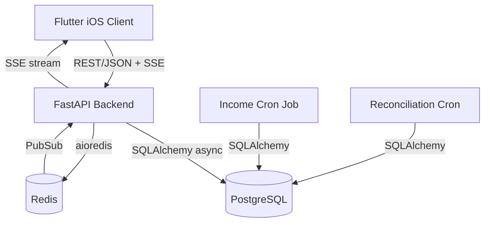
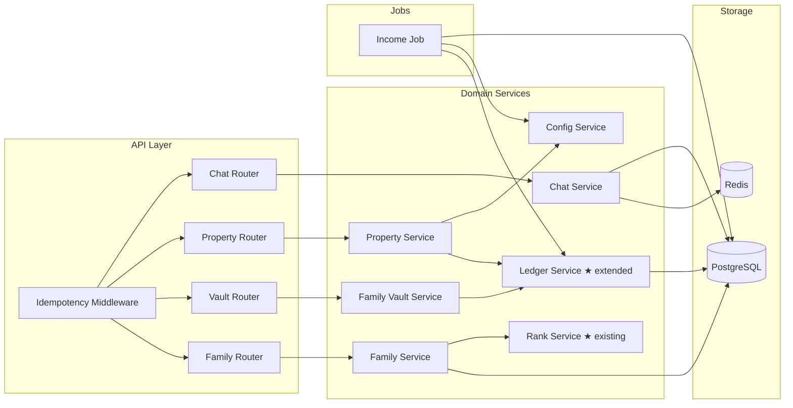
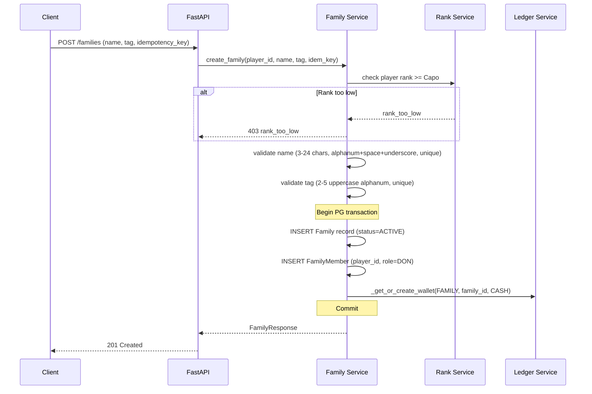
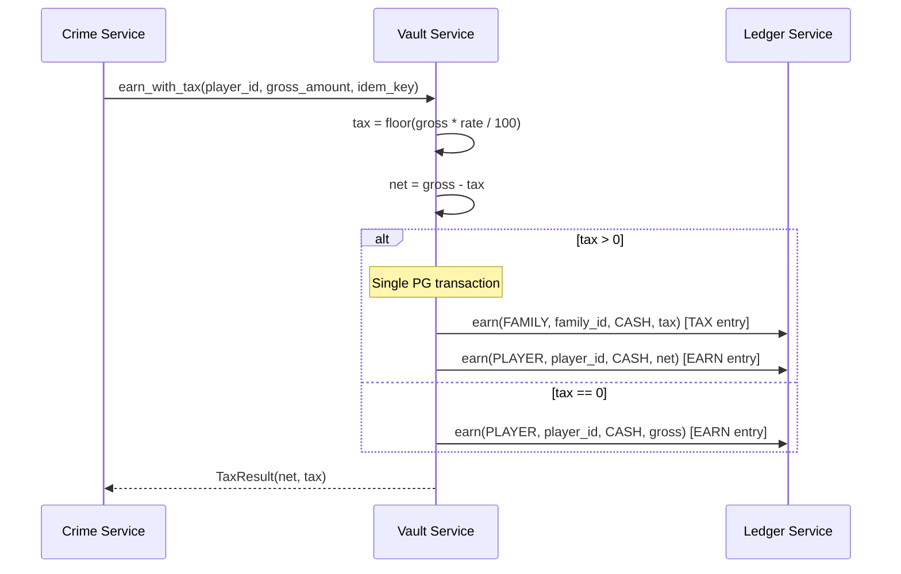

# Design Document — AI MAFIA: Milestone 2 (Syndicate & Social)

## Overview

Milestone 2 adds the social/syndicate layer on top of the Milestone 1 core loop. Players who reach Rank 4 (Capo, 25,000 XP) can create or join a Family. Families have a four-tier role hierarchy (Don → Underboss → Capo → Soldier), a shared Vault funded by automatic 10% tax on member CASH earnings, purchasable Properties that generate daily passive income, and a real-time SSE chat channel backed by Redis PubSub.

The backend extends the existing FastAPI service with four new domain services (FamilyService, FamilyVaultService, PropertyService, ChatService), one new cron job (IncomeJob), and new Ledger operations (SPEND, TRANSFER). All financial mutations continue to flow through the immutable Ledger Service. The existing Wallet model already supports `owner_type=FAMILY`, so Family Vaults are just Wallets with that owner type.

### Key Design Decisions

1. **Family Vault = Wallet with owner_type=FAMILY** — No new financial model needed. The existing Wallet/LedgerEntry infrastructure handles Family funds identically to Player funds. The reconciliation job already covers FAMILY wallets.
2. **New Ledger operations: `spend()` and `transfer()`** — Milestone 1 only implemented `reserve/capture/release/earn`. Milestone 2 needs `spend()` (debit wallet, SPEND/POSTED entry) for Property purchases/upgrades and `transfer()` (debit source wallet, credit target wallet, two TRANSFER/POSTED entries) for vault withdrawals and disband payouts.
3. **Tax as a Ledger concern** — The 10% vault tax is applied at the point of CASH earning. Instead of calling `ledger.earn()` directly, Family members' earnings go through `FamilyVaultService.earn_with_tax()` which atomically creates a TAX entry (vault credit) and a reduced EARN entry (player credit) in a single DB transaction.
4. **SSE via Redis PubSub** — Chat uses Server-Sent Events with Redis PubSub for fan-out across server instances. Messages are persisted to PostgreSQL for history backfill on reconnect. No WebSocket complexity needed for unidirectional server→client streaming.
5. **Property definitions from ConfigService** — Same pattern as CrimeDefinition: frozen dataclasses loaded from ConfigService JSON, not DB models. Property ownership records (family_id, property_id, level) are DB models.
6. **IncomeJob follows ReconciliationJob pattern** — Daily cron, iterates all active families with properties, credits vault via `ledger.earn()` with date-scoped idempotency keys to prevent duplicate payouts.
7. **Role hierarchy enforced numerically** — Roles map to integers (Don=4, Underboss=3, Capo=2, Soldier=1). Permission checks are simple numeric comparisons: `actor_role > target_role`.

## Architecture

### System Context Diagram (Milestone 2 additions)



### Service Architecture (Milestone 2)



### Family Creation & Tax Flow



### Tax Collection Flow (on Crime Payout)



## Components and Interfaces

### 1. Family Service (`services/api_fastapi/domain/services/family_service.py`)

**Responsibilities:** Family CRUD, membership management, role hierarchy enforcement, dissolution.

```python
class FamilyRole(int, enum.Enum):
    SOLDIER = 1
    CAPO = 2
    UNDERBOSS = 3
    DON = 4

class FamilyService:
    def __init__(self, redis: aioredis.Redis, config: ConfigService) -> None: ...

    # --- Creation / Dissolution ---
    async def create_family(
        self, session: AsyncSession, player_id: UUID,
        name: str, tag: str, idempotency_key: str,
    ) -> FamilyResult:
        """
        1. Check player rank >= Capo (via player.rank)
        2. Check player not already in a family
        3. Validate name (3-24 chars, ^[a-zA-Z0-9_ ]{3,24}$, unique)
        4. Validate tag (2-5 chars, ^[A-Z0-9]{2,5}$, unique)
        5. Create Family record, FamilyMember(role=DON)
        6. Create FAMILY Wallet via ledger._get_or_create_wallet
        """

    async def disband_family(
        self, session: AsyncSession, player_id: UUID, idempotency_key: str,
    ) -> DisbandResult:
        """
        1. Verify player is Don
        2. Verify no other members remain
        3. Transfer vault balance to Don via ledger.transfer()
        4. Mark family as DISBANDED, remove Don from roster
        5. Release name/tag for reuse
        """

    # --- Membership ---
    async def join_family(
        self, session: AsyncSession, player_id: UUID,
        family_id: UUID, idempotency_key: str,
    ) -> MembershipResult:
        """
        1. Check player rank >= Capo
        2. Check player not already in a family
        3. Check family not full (max_family_members from config)
        4. Add as Soldier
        """

    async def leave_family(
        self, session: AsyncSession, player_id: UUID, idempotency_key: str,
    ) -> None:
        """
        1. Check player is member
        2. If Don with other members → reject (don_must_transfer_or_disband)
        3. Remove from roster
        """

    async def kick_member(
        self, session: AsyncSession, actor_id: UUID,
        target_id: UUID, idempotency_key: str,
    ) -> None:
        """
        1. Verify actor.role > target.role (numeric comparison)
        2. Remove target from roster
        """

    # --- Role Management ---
    async def promote_member(
        self, session: AsyncSession, actor_id: UUID,
        target_id: UUID, new_role: FamilyRole, idempotency_key: str,
    ) -> RoleChangeResult:
        """
        1. Verify actor is Don (only Don can promote)
        2. Verify promotion is exactly one step up
        3. Check role limits (max 1 Underboss, max N Capos)
        4. Update member role
        """

    async def demote_member(
        self, session: AsyncSession, actor_id: UUID,
        target_id: UUID, new_role: FamilyRole, idempotency_key: str,
    ) -> RoleChangeResult:
        """
        1. Verify actor.role > target.role
        2. Don or Underboss can demote Capo→Soldier
        3. Only Don can demote Underboss→Capo
        4. Update member role
        """

    async def transfer_don(
        self, session: AsyncSession, actor_id: UUID,
        target_id: UUID, idempotency_key: str,
    ) -> RoleChangeResult:
        """
        1. Verify actor is current Don
        2. Assign DON to target
        3. Demote former Don to Underboss (or Capo if Underboss occupied)
        """

    # --- Queries ---
    async def get_family(self, session: AsyncSession, family_id: UUID) -> FamilyDetail: ...
    async def get_player_family(self, session: AsyncSession, player_id: UUID) -> Optional[FamilyDetail]: ...
    async def list_members(self, session: AsyncSession, family_id: UUID) -> List[MemberInfo]: ...
```

### 2. Family Vault Service (`services/api_fastapi/domain/services/vault_service.py`)

**Responsibilities:** Tax collection on earnings, Don-authorized withdrawals.

```python
class FamilyVaultService:
    def __init__(self, config: ConfigService) -> None: ...

    async def earn_with_tax(
        self, session: AsyncSession, player_id: UUID,
        family_id: UUID, gross_amount: int, idempotency_key: str,
    ) -> TaxResult:
        """
        1. tax = floor(gross_amount * vault_tax_rate / 100)
        2. net = gross_amount - tax
        3. If tax > 0:
           a. ledger.earn(FAMILY, family_id, CASH, tax, idem_key + ":tax")  [TAX entry]
           b. ledger.earn(PLAYER, player_id, CASH, net, idem_key + ":net")  [EARN entry]
        4. If tax == 0:
           a. ledger.earn(PLAYER, player_id, CASH, gross_amount, idem_key)
        All within caller's DB transaction.
        """

    async def withdraw(
        self, session: AsyncSession, actor_id: UUID,
        family_id: UUID, target_member_id: UUID,
        amount: int, idempotency_key: str,
    ) -> WithdrawResult:
        """
        1. Verify actor is Don
        2. Verify target is current family member
        3. ledger.transfer(FAMILY→PLAYER, amount, idem_key)
        """

    async def get_vault_balance(
        self, session: AsyncSession, family_id: UUID,
    ) -> int:
        """Read Family Wallet balance."""
```

### 3. Property Service (`services/api_fastapi/domain/services/property_service.py`)

**Responsibilities:** Property purchase, upgrade, income calculation.

```python
@dataclass(frozen=True)
class PropertyDefinition:
    property_id: str        # e.g. "speakeasy", "casino", "docks"
    name: str
    purchase_price: int     # integer CASH
    daily_income: int       # base daily income at level 1
    max_level: int

class PropertyService:
    def __init__(self, config: ConfigService) -> None: ...

    async def purchase_property(
        self, session: AsyncSession, actor_id: UUID,
        family_id: UUID, property_id: str, idempotency_key: str,
    ) -> PropertyOwnership:
        """
        1. Verify actor is Don
        2. Load PropertyDefinition from config
        3. Check family doesn't already own this property
        4. ledger.spend(FAMILY, family_id, CASH, purchase_price, idem_key)
        5. Create FamilyProperty record at level 1
        """

    async def upgrade_property(
        self, session: AsyncSession, actor_id: UUID,
        family_id: UUID, property_id: str, idempotency_key: str,
    ) -> PropertyOwnership:
        """
        1. Verify actor is Don
        2. Load ownership record, check not at max_level
        3. cost = purchase_price * current_level
        4. ledger.spend(FAMILY, family_id, CASH, cost, idem_key)
        5. Increment level
        """

    async def calculate_daily_income(
        self, session: AsyncSession, family_id: UUID,
    ) -> int:
        """Sum of (base_daily_income * level) for all owned properties."""

    async def list_properties(self, config: ConfigService) -> List[PropertyDefinition]: ...
    async def list_family_properties(self, session: AsyncSession, family_id: UUID) -> List[PropertyOwnership]: ...
```

### 4. Chat Service (`services/api_fastapi/domain/services/chat_service.py`)

**Responsibilities:** SSE message delivery, message persistence, history backfill.

```python
class ChatService:
    def __init__(self, redis: aioredis.Redis, config: ConfigService) -> None: ...

    async def send_message(
        self, session: AsyncSession, player_id: UUID,
        family_id: UUID, body: str,
    ) -> ChatMessage:
        """
        1. Validate body length (1-500 chars)
        2. Persist to chat_messages table
        3. Publish to Redis PubSub channel: family_chat:{family_id}
        """

    async def get_history(
        self, session: AsyncSession, family_id: UUID,
        limit: Optional[int] = None,
    ) -> List[ChatMessage]:
        """Return most recent N messages (default from config: chat_history_limit)."""

    async def subscribe(self, family_id: UUID) -> AsyncGenerator[ChatEvent, None]:
        """
        Yield SSE events from Redis PubSub channel.
        Includes periodic heartbeat events (configurable interval).
        """
```

### 5. Income Job (`services/api_fastapi/domain/jobs/income_job.py`)

**Responsibilities:** Daily passive income distribution from Properties to Family Vaults.

```python
class IncomeJob:
    def __init__(
        self, session: AsyncSession, config: ConfigService,
    ) -> None: ...

    async def run(self) -> IncomeReport:
        """
        1. Query all active families with at least one property
        2. For each family:
           a. total_income = sum(base_daily_income * level) for each property
           b. ledger.earn(FAMILY, family_id, CASH, total_income,
                          idem_key=f"income:{family_id}:{date}")
        3. Log summary: families_processed, total_distributed, execution_time
        4. On per-family error: log and continue (don't halt)
        """
```

### 6. Ledger Service Extensions

Two new operations added to `services/api_fastapi/domain/services/ledger_service.py`:

```python
async def spend(
    session: AsyncSession, *,
    owner_type: OwnerType, owner_id, currency: Currency,
    amount: int, reference_id: str, metadata: Dict[str, Any],
    idempotency_key: str,
) -> LedgerResult:
    """SPEND: debit wallet balance, append SPEND(POSTED) row, idempotent.
    Raises InsufficientFunds if balance < amount."""

async def transfer(
    session: AsyncSession, *,
    from_owner_type: OwnerType, from_owner_id,
    to_owner_type: OwnerType, to_owner_id,
    currency: Currency, amount: int,
    reference_id: str, metadata: Dict[str, Any],
    idempotency_key: str,
) -> TransferResult:
    """TRANSFER: debit source wallet, credit target wallet,
    append two TRANSFER(POSTED) rows (one debit, one credit), idempotent.
    Raises InsufficientFunds if source balance < amount."""
```

### API Endpoints (Milestone 2)

| Method | Path | Auth | Idempotency | Service |
|--------|------|------|-------------|---------|
| POST | `/families` | JWT + Age | Yes | Family (create) |
| GET | `/families/{family_id}` | JWT + Age | No | Family (detail) |
| GET | `/families/me` | JWT + Age | No | Family (player's family) |
| POST | `/families/{family_id}/join` | JWT + Age | Yes | Family (join) |
| POST | `/families/me/leave` | JWT + Age | Yes | Family (leave) |
| POST | `/families/me/kick` | JWT + Age | Yes | Family (kick) |
| POST | `/families/me/promote` | JWT + Age | Yes | Family (promote) |
| POST | `/families/me/demote` | JWT + Age | Yes | Family (demote) |
| POST | `/families/me/transfer-don` | JWT + Age | Yes | Family (transfer) |
| POST | `/families/me/disband` | JWT + Age | Yes | Family (disband) |
| GET | `/families/me/vault` | JWT + Age | No | Vault (balance) |
| POST | `/families/me/vault/withdraw` | JWT + Age | Yes | Vault (withdraw) |
| GET | `/properties` | JWT + Age | No | Property (list defs) |
| GET | `/families/me/properties` | JWT + Age | No | Property (family's) |
| POST | `/families/me/properties/{property_id}/purchase` | JWT + Age | Yes | Property (buy) |
| POST | `/families/me/properties/{property_id}/upgrade` | JWT + Age | Yes | Property (upgrade) |
| GET | `/families/me/chat` | JWT + Age | No | Chat (SSE stream) |
| POST | `/families/me/chat` | JWT + Age | No | Chat (send message) |
| GET | `/families/me/chat/history` | JWT + Age | No | Chat (backfill) |

## Data Models

### Existing Models (extended)

**Wallet** and **LedgerEntry** — No schema changes. The existing `OwnerType.FAMILY` enum value and `LedgerEntryType.SPEND/TAX/TRANSFER` enum values are already defined. Family Vaults are simply Wallets with `owner_type=FAMILY`.

**LedgerEntry** — The `TRANSFER` entry type requires a counterparty reference. We add two nullable columns to LedgerEntry:
- `counterparty_owner_type` (nullable OwnerType) — the other party in a transfer
- `counterparty_owner_id` (nullable UUID) — the other party's ID

Note: The existing `_append_ledger` helper already accepts these as optional kwargs, so the code path is ready. We just need the Alembic migration to add the columns.

### New Models

#### Family (`services/api_fastapi/domain/models/family.py`)

```python
class FamilyStatus(str, enum.Enum):
    ACTIVE = "ACTIVE"
    DISBANDED = "DISBANDED"

class Family(Base):
    __tablename__ = "families"

    id: Mapped[uuid.UUID] = mapped_column(UUID(as_uuid=True), primary_key=True, default=uuid.uuid4)
    name: Mapped[str] = mapped_column(String(24), nullable=False)
    tag: Mapped[str] = mapped_column(String(5), nullable=False)
    status: Mapped[FamilyStatus] = mapped_column(
        Enum(FamilyStatus, name="family_status"), nullable=False, default=FamilyStatus.ACTIVE
    )
    created_at: Mapped[datetime] = mapped_column(DateTime(timezone=True), nullable=False, default=datetime.utcnow)
    disbanded_at: Mapped[Optional[datetime]] = mapped_column(DateTime(timezone=True), nullable=True)

    __table_args__ = (
        UniqueConstraint("name", name="uq_family_name"),
        UniqueConstraint("tag", name="uq_family_tag"),
        CheckConstraint("char_length(name) >= 3 AND char_length(name) <= 24", name="ck_family_name_length"),
        CheckConstraint("char_length(tag) >= 2 AND char_length(tag) <= 5", name="ck_family_tag_length"),
    )
```

**Design notes:**
- `name` and `tag` have unique constraints. On disband, the family status changes to DISBANDED but the row remains. To allow name/tag reuse, the unique constraints are partial (only on ACTIVE families) — implemented via a partial unique index in the migration rather than a table-level constraint.
- `status` enum allows future states (e.g., SUSPENDED) without schema changes.

#### FamilyMember (`services/api_fastapi/domain/models/family.py`)

```python
class FamilyRole(str, enum.Enum):
    SOLDIER = "SOLDIER"
    CAPO = "CAPO"
    UNDERBOSS = "UNDERBOSS"
    DON = "DON"

# Numeric mapping for permission comparisons
ROLE_RANK = {
    FamilyRole.SOLDIER: 1,
    FamilyRole.CAPO: 2,
    FamilyRole.UNDERBOSS: 3,
    FamilyRole.DON: 4,
}

class FamilyMember(Base):
    __tablename__ = "family_members"

    id: Mapped[uuid.UUID] = mapped_column(UUID(as_uuid=True), primary_key=True, default=uuid.uuid4)
    family_id: Mapped[uuid.UUID] = mapped_column(UUID(as_uuid=True), ForeignKey("families.id"), nullable=False)
    player_id: Mapped[uuid.UUID] = mapped_column(UUID(as_uuid=True), ForeignKey("players.id"), nullable=False)
    role: Mapped[FamilyRole] = mapped_column(Enum(FamilyRole, name="family_role"), nullable=False)
    joined_at: Mapped[datetime] = mapped_column(DateTime(timezone=True), nullable=False, default=datetime.utcnow)

    __table_args__ = (
        UniqueConstraint("player_id", name="uq_family_member_player"),  # one family per player
        Index("ix_family_member_family", "family_id"),
    )
```

**Design notes:**
- `UniqueConstraint("player_id")` enforces one family per player at the DB level.
- On leave/kick, the row is deleted (not soft-deleted) to free the unique constraint.
- `ForeignKey("families.id")` and `ForeignKey("players.id")` enforce referential integrity.

#### FamilyProperty (`services/api_fastapi/domain/models/family.py`)

```python
class FamilyProperty(Base):
    __tablename__ = "family_properties"

    id: Mapped[uuid.UUID] = mapped_column(UUID(as_uuid=True), primary_key=True, default=uuid.uuid4)
    family_id: Mapped[uuid.UUID] = mapped_column(UUID(as_uuid=True), ForeignKey("families.id"), nullable=False)
    property_id: Mapped[str] = mapped_column(String(64), nullable=False)  # references config definition
    level: Mapped[int] = mapped_column(BigInteger, nullable=False, default=1)
    purchased_at: Mapped[datetime] = mapped_column(DateTime(timezone=True), nullable=False, default=datetime.utcnow)
    updated_at: Mapped[datetime] = mapped_column(DateTime(timezone=True), nullable=False, default=datetime.utcnow)

    __table_args__ = (
        UniqueConstraint("family_id", "property_id", name="uq_family_property"),
        CheckConstraint("level >= 1", name="ck_property_level_min"),
    )
```

#### ChatMessage (`services/api_fastapi/domain/models/chat.py`)

```python
class ChatMessage(Base):
    __tablename__ = "chat_messages"

    id: Mapped[uuid.UUID] = mapped_column(UUID(as_uuid=True), primary_key=True, default=uuid.uuid4)
    family_id: Mapped[uuid.UUID] = mapped_column(UUID(as_uuid=True), ForeignKey("families.id"), nullable=False)
    player_id: Mapped[uuid.UUID] = mapped_column(UUID(as_uuid=True), ForeignKey("players.id"), nullable=False)
    display_name: Mapped[str] = mapped_column(String(20), nullable=False)
    body: Mapped[str] = mapped_column(String(500), nullable=False)
    created_at: Mapped[datetime] = mapped_column(DateTime(timezone=True), nullable=False, default=datetime.utcnow)

    __table_args__ = (
        Index("ix_chat_family_time", "family_id", "created_at"),
        CheckConstraint("char_length(body) >= 1 AND char_length(body) <= 500", name="ck_chat_body_length"),
    )
```

#### PropertyDefinition (config-driven, not a DB model)

```python
@dataclass(frozen=True)
class PropertyDefinition:
    property_id: str        # e.g. "speakeasy", "casino", "docks"
    name: str
    purchase_price: int     # integer CASH
    daily_income: int       # base daily income at level 1
    max_level: int

async def load_property_definitions(config: ConfigService) -> List[PropertyDefinition]:
    """Load from ConfigService PROPERTY_DEFINITIONS key (JSON array)."""
    raw = await config.get_json(PROPERTY_DEFINITIONS, default=[])
    return [PropertyDefinition(**entry) for entry in raw]
```

### ConfigService Extensions

New keys added to `config_service.py`:

```python
# Family
VAULT_TAX_RATE = "VAULT_TAX_RATE"                      # default 10 (percent)
MAX_FAMILY_MEMBERS = "MAX_FAMILY_MEMBERS"               # default 25
MAX_CAPO_COUNT = "MAX_CAPO_COUNT"                       # default 3

# Property
PROPERTY_DEFINITIONS = "PROPERTY_DEFINITIONS"           # JSON array

# Income Job
INCOME_JOB_SCHEDULE = "INCOME_JOB_SCHEDULE"             # default "0 5 * * *"

# Chat
CHAT_HISTORY_LIMIT = "CHAT_HISTORY_LIMIT"               # default 50
CHAT_HEARTBEAT_INTERVAL = "CHAT_HEARTBEAT_INTERVAL"     # default 30 (seconds)
```

### Redis Data Structures (Milestone 2 additions)

| Key Pattern | Type | Purpose | TTL |
|-------------|------|---------|-----|
| `family_chat:{family_id}` | PubSub channel | Real-time chat fan-out | N/A |
| `config:VAULT_TAX_RATE` | String | Hot-reload tax rate | None |
| `config:MAX_FAMILY_MEMBERS` | String | Hot-reload member cap | None |
| `config:MAX_CAPO_COUNT` | String | Hot-reload capo limit | None |
| `config:PROPERTY_DEFINITIONS` | String | Hot-reload property defs | None |
| `config:INCOME_JOB_SCHEDULE` | String | Hot-reload cron schedule | None |
| `config:CHAT_HISTORY_LIMIT` | String | Hot-reload history limit | None |
| `config:CHAT_HEARTBEAT_INTERVAL` | String | Hot-reload heartbeat | None |

### Entity Relationship Diagram (Milestone 2)

```mermaid
erDiagram
    Player ||--o{ FamilyMember : "belongs to"
    Family ||--o{ FamilyMember : "has"
    Family ||--o{ FamilyProperty : "owns"
    Family ||--o{ ChatMessage : "has"
    Family ||--o| Wallet : "vault"
    Player ||--o{ ChatMessage : "sends"
    Player ||--o{ Wallet : "owns"

    Family {
        uuid id PK
        string name UK
        string tag UK
        enum status
        datetime created_at
        datetime disbanded_at
    }
    FamilyMember {
        uuid id PK
        uuid family_id FK
        uuid player_id FK_UK
        enum role
        datetime joined_at
    }
    FamilyProperty {
        uuid id PK
        uuid family_id FK
        string property_id
        int level
        datetime purchased_at
    }
    ChatMessage {
        uuid id PK
        uuid family_id FK
        uuid player_id FK
        string display_name
        string body
        datetime created_at
    }
    Wallet {
        uuid id PK
        enum owner_type
        uuid owner_id
        enum currency
        bigint balance
    }
```

### Alembic Migration

A single migration file `002_milestone2_syndicate.py` will:

1. Add `counterparty_owner_type` and `counterparty_owner_id` nullable columns to `ledger_entries`
2. Create `families` table
3. Create `family_members` table with unique constraint on `player_id`
4. Create `family_properties` table with unique constraint on `(family_id, property_id)`
5. Create `chat_messages` table with index on `(family_id, created_at)`
6. Create partial unique indexes on `families.name` and `families.tag` WHERE `status = 'ACTIVE'`

## Correctness Properties

*A property is a characteristic or behavior that should hold true across all valid executions of a system — essentially, a formal statement about what the system should do. Properties serve as the bridge between human-readable specifications and machine-verifiable correctness guarantees.*

### Property 1: Family creation produces Don + zero-balance vault

*For any* player with rank >= Capo who is not already in a family, and any valid name/tag pair, creating a family should produce: (a) a Family record with status=ACTIVE, (b) a FamilyMember record with role=DON for that player, and (c) a Wallet with owner_type=FAMILY and balance=0.

**Validates: Requirements 1.1**

### Property 2: Family name and tag validation

*For any* string, the Family name validation should accept it if and only if it matches `^[a-zA-Z0-9_ ]{3,24}$`. *For any* string, the Family tag validation should accept it if and only if it matches `^[A-Z0-9]{2,5}$`.

**Validates: Requirements 1.2, 1.3**

### Property 3: Rank gate rejects below-Capo players

*For any* player with rank below Capo (i.e., Empty-Suit, Runner, or Enforcer), attempting to create a family, join a family, or perform any family/property action should be rejected with a "rank_too_low" error, and no state should change.

**Validates: Requirements 1.4, 2.2, 11.1, 11.2, 11.3**

### Property 4: One family per player invariant

*For any* player who is already a member of a family, attempting to create a new family or join another family should be rejected with an "already_in_family" error, and no state should change.

**Validates: Requirements 1.5, 2.3**

### Property 5: Join adds as Soldier and respects capacity

*For any* valid player (rank >= Capo, not in a family) and any family below max member count, joining should add the player as a Soldier. *For any* family at max member count, joining should be rejected with a "family_full" error.

**Validates: Requirements 2.1, 2.4**

### Property 6: Non-Don members can leave freely

*For any* family member with role Soldier, Capo, or Underboss, leaving the family should remove them from the roster. After leaving, the player should not appear in the family's member list.

**Validates: Requirements 2.5**

### Property 7: Kick requires strictly higher role

*For any* actor and target in the same family, kicking should succeed if and only if the actor's role rank is strictly greater than the target's role rank. On success, the target is removed from the roster. On failure (equal or lower role), the request is rejected with "insufficient_permission" and no state changes.

**Validates: Requirements 2.7, 2.8, 2.9, 2.10**

### Property 8: Promotion respects role limits and authority

*For any* promotion attempt: (a) only the Don can promote, (b) Soldier→Capo succeeds only if current Capo count < max_capo_count, (c) Capo→Underboss succeeds only if no Underboss exists. If the role limit is reached, the request is rejected with "role_limit_reached". If the actor lacks authority, the request is rejected with "insufficient_permission".

**Validates: Requirements 3.1, 3.2, 3.5, 3.6**

### Property 9: Demotion respects role authority

*For any* demotion attempt: (a) only Don can demote Underboss→Capo, (b) Don or Underboss can demote Capo→Soldier. If the actor lacks sufficient role authority, the request is rejected with "insufficient_permission".

**Validates: Requirements 3.3, 3.4, 3.6**

### Property 10: Don transfer assigns Don and demotes former Don

*For any* Don transfer to a target member, the target should become Don, and the former Don should become Underboss. If an Underboss already exists, the former Don should become Capo instead. Exactly one Don should exist in the family after the transfer.

**Validates: Requirements 3.7**

### Property 11: Disband requires sole member and transfers vault

*For any* family where the Don is the only member, disbanding should: (a) mark the family as DISBANDED, (b) remove the Don from the roster, (c) transfer the full vault balance to the Don's personal wallet via a TRANSFER ledger entry. *For any* family with more than one member, disbanding should be rejected with "family_has_members".

**Validates: Requirements 4.1, 4.2, 4.3**

### Property 12: Tax invariant — player net + vault tax == gross

*For any* positive gross CASH amount and any vault_tax_rate in [0, 100], the tax calculation should satisfy: `tax = floor(gross * rate / 100)`, `net = gross - tax`, and `net + tax == gross`. When tax > 0, the vault receives exactly `tax` and the player receives exactly `net`. When tax == 0, the player receives the full gross amount.

**Validates: Requirements 5.1, 5.2, 5.3, 5.4**

### Property 13: Tax atomicity — both entries or neither

*For any* earn-with-tax operation where tax > 0, either both the TAX entry (vault credit) and the EARN entry (player credit) exist in the ledger, or neither exists. There is no state where only one of the two entries is present.

**Validates: Requirements 5.5**

### Property 14: Vault withdrawal transfers correct amount

*For any* valid withdrawal (actor is Don, target is family member, amount <= vault balance), the vault wallet balance should decrease by exactly `amount` and the target player's wallet balance should increase by exactly `amount`, via TRANSFER ledger entries.

**Validates: Requirements 6.1**

### Property 15: Don-only actions reject non-Don actors

*For any* player who is not the Don of their family, attempting a vault withdrawal, property purchase, or property upgrade should be rejected with "insufficient_permission" and no state should change.

**Validates: Requirements 6.3, 8.4, 9.6**

### Property 16: Insufficient vault funds rejects over-balance operations

*For any* vault operation (withdrawal, property purchase, property upgrade) where the requested amount exceeds the vault's available CASH balance, the operation should be rejected with "insufficient_vault_funds" and no state should change.

**Validates: Requirements 6.2, 8.3, 9.5**

### Property 17: Chat message validation and persistence

*For any* string of length 1–500, sending it as a chat message should persist a record with the correct player_id, family_id, display_name, body, and a non-null timestamp. *For any* empty string or string exceeding 500 characters, sending should be rejected with "invalid_message_length".

**Validates: Requirements 7.2, 7.4**

### Property 18: Chat history returns most recent N messages in order

*For any* family with M persisted messages and a configured history limit of N, requesting chat history should return exactly min(M, N) messages, ordered by timestamp descending (most recent first).

**Validates: Requirements 7.6**

### Property 19: Chat access restricted to family members

*For any* player who is not a member of a given family, attempting to send a message or access chat history for that family should be rejected with "unauthorized".

**Validates: Requirements 7.5**

### Property 20: Property purchase creates level-1 ownership

*For any* valid property purchase (actor is Don, vault has sufficient funds, family doesn't already own the property), the vault balance should decrease by exactly `purchase_price`, and a FamilyProperty record should be created at level 1. If the family already owns the property, the request should be rejected with "already_owned".

**Validates: Requirements 8.2, 8.5**

### Property 21: Property definition round-trip

*For any* valid PropertyDefinition, serializing it to JSON and deserializing it back should produce an equivalent PropertyDefinition with all fields (property_id, name, purchase_price, daily_income, max_level) preserved.

**Validates: Requirements 8.1**

### Property 22: Property cost and income formulas

*For any* property with purchase_price P, base_daily_income D, and current level L: (a) upgrade cost = P * L, (b) daily income at level L = D * L. These formulas hold for all valid levels 1 through max_level.

**Validates: Requirements 9.2, 9.3**

### Property 23: Property upgrade increments level and deducts correct cost

*For any* valid upgrade (actor is Don, property not at max_level, vault has sufficient funds), the property level should increment by exactly 1, and the vault balance should decrease by exactly `purchase_price * current_level`. If the property is at max_level, the request should be rejected with "max_level_reached".

**Validates: Requirements 9.1, 9.4**

### Property 24: Income job credits correct total per family

*For any* set of families with owned properties, the Income Job should credit each family's vault with exactly `sum(base_daily_income * level)` for all their properties, via EARN ledger entries with date-scoped idempotency keys. Running the job twice on the same date should not produce duplicate credits.

**Validates: Requirements 10.2, 10.3**

### Property 25: Income job resilience — per-family errors don't halt processing

*For any* set of N families where processing one family raises an error, the Income Job should still process the remaining N-1 families successfully.

**Validates: Requirements 10.5**

### Property 26: Wallet balance equals sum of posted ledger entries (extended)

*For any* wallet (including FAMILY wallets), the wallet's balance should equal the sum of all POSTED credit entries (EARN, CAPTURE, credit-side TRANSFER) minus the sum of all POSTED debit entries (SPEND, TAX, debit-side TRANSFER) for the same (owner_type, owner_id, currency) tuple. This extends M1 Property 19 to cover the new SPEND, TAX, and TRANSFER entry types.

**Validates: Requirements 5.2, 5.3, 6.1, 8.2, 9.1**

### Property 27: Idempotency on all M2 state-changing endpoints

*For any* Milestone 2 state-changing operation, executing it twice with the same idempotency key and identical payload should return the same result, and the operation should only be performed once. A request without an idempotency key should be rejected with "missing_idempotency_key".

**Validates: Requirements 1.6, 2.11, 3.8, 4.4, 5.6, 6.5, 8.6, 9.7, 13.1, 13.2, 13.3**

## Error Handling

### New Error Codes (Milestone 2)

| Code | HTTP Status | Retriable | Source | Description |
|------|-------------|-----------|--------|-------------|
| `rank_too_low` | 403 | No | Family/Property | Player rank below Capo |
| `already_in_family` | 409 | No | Family | Player already belongs to a family |
| `family_full` | 409 | No | Family | Family at max member count |
| `don_must_transfer_or_disband` | 409 | No | Family | Don cannot leave while members remain |
| `insufficient_permission` | 403 | No | Family/Vault/Property | Actor lacks required role |
| `role_limit_reached` | 409 | No | Family | Max count for target role reached |
| `family_has_members` | 409 | No | Family | Cannot disband with members remaining |
| `insufficient_vault_funds` | 409 | No | Vault/Property | Vault balance too low |
| `invalid_target_member` | 422 | No | Vault | Withdrawal target not a family member |
| `invalid_message_length` | 422 | No | Chat | Message empty or exceeds 500 chars |
| `already_owned` | 409 | No | Property | Family already owns this property |
| `max_level_reached` | 409 | No | Property | Property at maximum upgrade level |
| `family_not_found` | 404 | No | Family | Family ID does not exist |
| `not_in_family` | 403 | No | Family/Chat | Player is not a member of any family |

### Error Response Format

Same JSON envelope as Milestone 1:

```json
{
  "error": {
    "code": "rank_too_low",
    "message": "You must be Capo (Rank 4) or higher to create a Family.",
    "retriable": false
  }
}
```

### Transaction Failure Handling

**Family Vault Tax (earn_with_tax):**
- Both TAX and EARN ledger entries are created within the caller's DB transaction. If the transaction fails, both are rolled back atomically. No compensation needed.

**Property Purchase/Upgrade:**
- SPEND entry and FamilyProperty insert/update happen in the same DB transaction. Atomic rollback on failure.

**Vault Withdrawal (transfer):**
- Both TRANSFER entries (debit source, credit target) happen in the same DB transaction. Atomic rollback on failure.

**Income Job:**
- Each family is processed in its own transaction. A failure for one family is logged and does not affect others. Date-scoped idempotency keys prevent duplicate credits on retry.

## Testing Strategy

### Dual Testing Approach

This milestone uses both unit tests and property-based tests:

- **Unit tests** (pytest): Specific examples, edge cases, error conditions, integration points
- **Property-based tests** (Hypothesis): Universal properties across randomly generated inputs

Both are complementary. Unit tests catch concrete bugs and verify specific scenarios. Property tests verify general correctness across the input space.

### Property-Based Testing Configuration

- **Library:** [Hypothesis](https://hypothesis.readthedocs.io/) for Python
- **Minimum iterations:** 100 per property test (via `@settings(max_examples=100)`)
- **Each property test references its design property** with a tag comment:
  ```python
  # Feature: milestone2-syndicate-social, Property 12: Tax invariant — player net + vault tax == gross
  ```
- **Each correctness property is implemented by a single property-based test**

### Test Categories

#### Pure Function Property Tests (no I/O, fast)

These test pure computation logic with Hypothesis:

- **Property 2:** Family name/tag validation — generate random strings, verify regex acceptance
- **Property 12:** Tax invariant — generate random (gross_amount, tax_rate) pairs, verify `net + tax == gross`
- **Property 21:** PropertyDefinition round-trip — generate random definitions, serialize/deserialize
- **Property 22:** Property cost/income formulas — generate random (purchase_price, daily_income, level) tuples

#### Service-Level Property Tests (with DB/Redis fixtures)

These require async test fixtures with test databases:

- **Property 1:** Family creation produces Don + zero-balance vault
- **Property 3:** Rank gate rejects below-Capo players
- **Property 4:** One family per player invariant
- **Property 5:** Join adds as Soldier and respects capacity
- **Property 6:** Non-Don members can leave freely
- **Property 7:** Kick requires strictly higher role
- **Property 8:** Promotion respects role limits and authority
- **Property 9:** Demotion respects role authority
- **Property 10:** Don transfer assigns Don and demotes former Don
- **Property 11:** Disband requires sole member and transfers vault
- **Property 13:** Tax atomicity
- **Property 14:** Vault withdrawal transfers correct amount
- **Property 15:** Don-only actions reject non-Don actors
- **Property 16:** Insufficient vault funds rejects over-balance operations
- **Property 17:** Chat message validation and persistence
- **Property 18:** Chat history returns most recent N messages
- **Property 19:** Chat access restricted to family members
- **Property 20:** Property purchase creates level-1 ownership
- **Property 23:** Property upgrade increments level and deducts correct cost
- **Property 24:** Income job credits correct total per family
- **Property 25:** Income job resilience
- **Property 26:** Wallet balance equals sum of posted ledger entries (extended)
- **Property 27:** Idempotency on all M2 state-changing endpoints

#### Unit Tests (specific examples)

- Don cannot leave family with members → `don_must_transfer_or_disband`
- Disband with members → `family_has_members`
- Family name at exactly 3 and 24 characters (boundary)
- Family tag at exactly 2 and 5 characters (boundary)
- Tax on amount=9 at 10% rate → tax=0, player gets full amount
- Tax on amount=10 at 10% rate → tax=1, player gets 9
- Property at max_level → `max_level_reached`
- Duplicate property purchase → `already_owned`
- Withdrawal to non-member → `invalid_target_member`
- Chat message at exactly 1 and 500 characters (boundary)
- Income job report contains families_processed, total_distributed, execution_time
- ConfigService returns all M2 keys with correct defaults

#### Edge Case Tests

- Family with exactly 1 member (Don only) — disband should succeed
- Family at exactly max_family_members — join should fail
- Family with exactly max_capo_count Capos — promote Soldier→Capo should fail
- Vault balance exactly equal to purchase/withdrawal amount — should succeed
- Vault balance one less than required — should fail
- Don transfer when Underboss slot is occupied — former Don becomes Capo
- Don transfer when Underboss slot is empty — former Don becomes Underboss
- Income job with zero properties — no EARN entry created
- Income job retry on same date — idempotent, no duplicate credits
- Chat history with fewer messages than limit — returns all available

### Test Infrastructure

```
tests/
├── conftest.py                          # Shared fixtures (async DB session, Redis mock)
├── unit/
│   ├── test_family_validation.py        # Pure function tests for name/tag validation
│   ├── test_tax_computation.py          # Pure function tests for tax formula
│   ├── test_property_formulas.py        # Pure function tests for cost/income formulas
│   └── test_property_definition.py      # Round-trip serialization tests
├── property/
│   ├── test_family_properties.py        # Properties 1, 3, 4, 5, 6, 7
│   ├── test_role_properties.py          # Properties 8, 9, 10
│   ├── test_vault_properties.py         # Properties 12, 13, 14, 15, 16
│   ├── test_chat_properties.py          # Properties 17, 18, 19
│   ├── test_property_properties.py      # Properties 20, 21, 22, 23
│   ├── test_income_properties.py        # Properties 24, 25
│   ├── test_ledger_m2_properties.py     # Property 26
│   └── test_idempotency_m2.py           # Property 27
└── integration/
    ├── test_family_flow.py              # End-to-end family lifecycle
    ├── test_vault_tax_flow.py           # End-to-end tax collection
    ├── test_property_flow.py            # End-to-end property purchase/upgrade/income
    └── test_chat_flow.py               # End-to-end SSE chat
```
